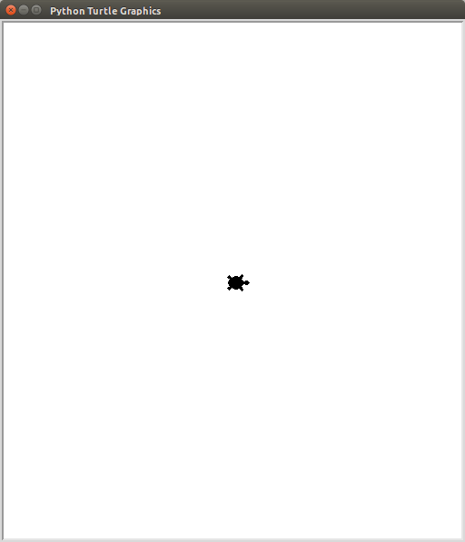
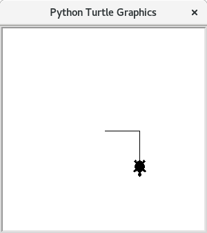
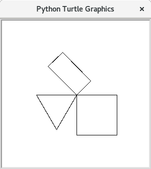

# Schildkröten

Nachdem Nun die gröbsten Grundlagen der Programmiersprache gelernt sind, fängt es jetzt an (noch mehr) Spaß zu machen. Im folgenden wird das Modul `turtle` verwendet. Dieses stellt eine einfache Möglichkeit zur Verfügung ein Fenster zu öffnen und in dieses Fenster mithilfe eines `turtles` zu zeichnen.

## Erstellen des Fensters

Zunächst muss das `turtle`-modul geladen werden. Danach wird das Fenster geöffnet mit dem Befehl `turtle.Pen()`. Damit später in dieses Fenster gezeichnet werden kann, muss es in einer Variablen gespeichert werden.

Wenn man möchte, kann man auch noch das aussehen der "Schildkröte" verändern. Die Standardeinstellung ist ein dreieck, dessen Spitze in Laufrichtung zeigt. Mit dem Befehl `t.shape("turtle")` wird diese Form zu einer Schildkrötensiluette.

Die Datei `meine-kröte.py` sieht also bis jetzt so aus:

```python
import turtle

t = turtle.Pen()
t.shape("turtle")
```

> ### Achtung
> Beim Speichern der Datei darf nicht der name `turtle.py` gewählt werden. Dieser Name wird quasi von dem `turtle`-Modul reserviert.

Nach dem Speichern und Ausführen, sollte ein Fenster sich öffnen, in dessen Mitte sich die Schildkröte befindet:



## Das Turtle bewegen und dabei zeichnen

Nun können Sie der Schildkröte Befehle geben. Es gibt unter anderem: `forward`, `left` und `right`. Dabei sind alle Befehle in Fahrtrichtung. Das heißt wenn am Anfang `left(90)` angegeben wird, dann schaut die Schildkröte zuerst nach rechts, und wird dann gegen den Urzeigersinn gedreht, sodass sie nach oben schaut.

Um also mit dem `turtle` einen rechten Winkel zu zeichnen, der zunächst waagerecht verläuft und dann nach unten geht kann man nun folgenden Code eingeben:

```python
import turtle

t = turtle.Pen()
t.shape("turtle")

t.forward(200)
t.right(90)
t.forward(200)
```
Das Ergebnis ist dann folgendes:



Es ist natürlich auch möglich weniger weit zu gehen `t.forward(87)` oder sich um einen anderen Winkel zu drehen `t.left(63)`.

> ### Übungen
> 1. Zeichnen Sie ein Quadrat
> 1. Zeichnen Sie ein Rechteck, welches doppelt so breit ist, wie hoch, aber vollständig in dem ersten Quadrat liegt. (Es darf gemeinsame Kanten und Ecken haben)
> 1. Zeichnen Sie ein gleichseitiges Dreieck
> 
> Ergebis der Übung:
> 
> 
