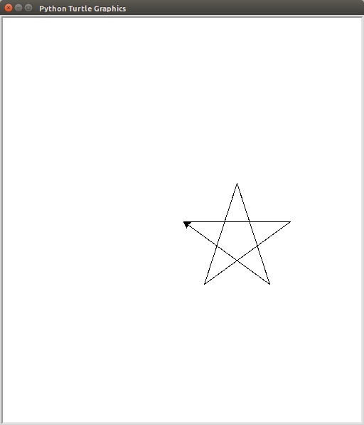

# Sterne zeichnen mit Turtle

[Zurück zu Kapitel 11: Mehrmaliges tun](Turtle-Wiederholungen.md) |  [Inhaltsverzeichnis](README.md) |  [Weiter zu Kapitel 13: Kreise](Kreise.md) | 

> ### Übung
> 
> Speichern Sie diese Übung als `sternchen-uebung.py`
>
> Zeichnen Sie einen Fünfstern. Der Innenwinkel in einem Fünfstern ist 36° Grad.
> 
> 

Im Folgenden wird es Ziel sein viele Fünfsterne zu zeichnen in unterschiedlichen Größen.
Eine Möglichkeit das zu tun wäre nun, den bisher geschriebenen Code einfach zu kopieren und woanders wieder einzufügen.
Man muss nun nur noch ein paar Zahlen ändern und fertig ist der zweite Stern.

## Funktionen

Beim Programmieren möchte man aber solche wiederholende Aufgaben eigentlich lieber den Computer selbst machen lassen.
Das heißt man schreibt zunächst eine Schablone und sagt dem Computer was er veränderbar in dieser Schablone machen soll.

Eine Schablone, beim Programmieren nennt man solche Schablonen Funktion, erstellt man So:

```
def stern(größe):
    t.forward(größe)
    t.left(144)
```

Indem man zunächst das Schlüsselwort `def` schreibt, sagt man Python dass nun eine Schablone kommt, die nicht sofort ausgeführt
werden soll, sondern die sich das Programm erstmal merken soll. Danach folgt ein beliebiger Name in diesem Fall ist `stern` gewählt worden.
Zuletzt kommt in Klammern eine Liste der veränderlichen Namen als Platzhalter. Für den Stern wird erstmal nur die `größe` veränderlich sein.
Statt nun eine feste Zahl vorwärts zu gehen, muss man jetzt die veränderliche größe aus der Schablone vorwärts gehen.
Für alle Fünfsterne sind die Winkel die selben. Das heißt man kann die Zeilen mit `left` unveränderbar lassen,
indem man einfach konstante Zahlen schreibt.

Diese Funktionsschablone wird jetzt aber noch nicht ausgeführt. Man sagt Python nur wie die Schablone aussieht.
Um jetzt einen Stern zu zeichnen, muss man diese Schablone verwenden, und Python sagen, welcher Platzhalter welchen Wert annehmen soll.

```
stern(größe=100)
```

Jetzt wird tatsächlich etwas gezeichnet natürlich noch nicht der volle Stern, da bis jetzt nur eine Linie gezeichnet wird.
Zunächst schreibt man also einfach den Namen der Funktion,
dann in Klammern die Zuweisungen, welcher Platzhalter welchen Wert erhalten soll. Es kann Ihnen hier auffallen,
dass Sie die ganze Zeit schon solche Funktionen verwendet haben zum Beispiel `print`, `input`, ….

> ### Übung
>
> Speichern Sie diese Datei unter `sternhimmel-uebung.py`
>
> 1. Ergänzen Sie die `stern`-Funktion, sodass sie den gesamten Stern zeichnet
> 3. Zeichnen Sie 20 Sterne mit zufälliger Positionierung (siehe Kapitel Zufall)
> 2. Zeichnen Sie 20 verschieden große Sterne mit gleichem Zentrum
> 
> Beispiele:
> 
> 
> 

[Zurück zu Kapitel 11: Mehrmaliges tun](Turtle-Wiederholungen.md) |  [Inhaltsverzeichnis](README.md) |  [Weiter zu Kapitel 13: Kreise](Kreise.md) | 
