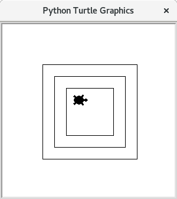

# Schildkröten


Nachdem Nun die gröbsten Grundlagen der Programmiersprache gelernt sind, fängt es jetzt an (noch mehr) Spaß zu machen.

## Schultern von Giganten

Bedenken Sie, dass beim Programmieren die eigene Arbeit immer auf der Arbeit von ganz vielen anderen beruht. Zum Beispiel um Python zu entwickeln müsste eine Person ca. 285 Jahre arbeiten. Um Python entwickeln zu lassen müsste man 13.5 Millionen Euro veranschlagen. Im Folgenden Wird ein relativ kleines Modul verwendet mit welchem man eine bestimmte Art von Grafiken erstellen kann. Auch für dieses Modul wurden über 4000 Zeilen programmiert.

## Erstellen des Fensters
Die Folgenden Schritte sind notwendig für jedes Turtle-Programm, also für jede Übung die in den Kapiteln 3-5 gestellt sind. Wenn Sie eine Übung erstellen müssen Sie immer mit den folgenden vier Schritten beginnen:
> 1. Erstellen Sie in `thonny` eine neue Datei durch Klick auf das weiße Symbol ganz links.
> 2. Schreiben sie die 3 Zeilen aus dem folgenden Beispiel in diese Datei. Die Zeilen werden später einzeln  erklärt.
>   ```python
>   import turtle
>
>   t = turtle.Pen()
>   t.shape("turtle")
>   ```
>
> 3. Klicken Sie auf "Play".
> 4. Speichern Sie die Datei unter einem Namen ab. Hier `meine-kröte.py`.

Es sollte ein Fenster mit einer kleinen Schildkröte in der Mitte erscheinen.


Erklärungen der Zeilen:

1. Zeile: Lade das `turtle`-Modul

2. Zeile: erzeugen der Schildkröte mit `turtle.Pen()`. Hierbei wird das Fenster, in dem die Zeichnung entsteht, geöffnet.

3. Zeile: Diese Zeile ist nicht unbedingt notwendig. Wenn man aber möchte, kann man das aussehen der "Schildkröte" verändern. Die Standardeinstellung ist ein Dreieck, dessen Spitze in Laufrichtung zeigt. Mit dem Befehl `t.shape("turtle")` wird diese Form zu einer Schildkrötensilhouette.

Diese drei Zeilen sind die Grundlage jedes turtle-Programms. Immer, wenn sie turtle verwenden wollen müssen diese Zeilen zu Beginn ihrer Datei stehen.

> ### Achtung
> **Beim Speichern der Datei darf nicht der Name `turtle.py` gewählt werden.** Dieser Name wird quasi von dem `turtle`-Modul reserviert.

## Das Turtle bewegen und dabei zeichnen

Nun können Sie der Schildkröte Befehle geben. Es gibt unter anderem: `forward`, `left` und `right`. Dabei sind alle Befehle in Fahrtrichtung. Die Schildkröte steht zu Beginn in der Mitte, so dass sie nach rechts läuft, wenn man ihr zum Beispiel den Befehl `t.forward(100)` gibt. Das heißt wenn am Anfang `t.left(90)` angegeben wird:  wird sie gegen den Uhrzeigersinn um 90° gedreht, sodass sie nach oben schaut.

> ### Merke
> * Die Befehle werden Zeile für Zeile ausgeführt.
> * Drückt man auf den grünen "Play-Knopf" wird alles neu gestartet, dann der Befehl in der ersten Zeile ausgeführt, dann der in der zweiten und so weiter.

Um also mit dem `turtle` einen rechten Winkel zu zeichnen, der zunächst waagerecht verläuft und dann nach unten geht kann man nun folgenden Code eingeben:

```python
import turtle

t = turtle.Pen()
t.shape("turtle")

t.forward(200)
t.right(90)
t.forward(200)
```
Das Ergebnis ist dann folgendes:


Es ist natürlich auch möglich weniger weit zu gehen `t.forward(87)` oder sich um einen anderen Winkel zu drehen `t.left(63)`.

> ### Übung
>
> Speichern Sie dies in die Datei `geometrische-uebung.py`
>
> 1. Zeichnen Sie ein Quadrat
> 1. Zeichnen Sie ein Rechteck, welches doppelt so breit ist, wie hoch und nur eine Ecke gemeinsam mit dem ersten Quadrat hat.
> 1. Zeichnen Sie ein gleichseitiges Dreieck
>
> Ergebnis der Übung:
>
> 

## Das Turtle bewegen, ohne zu zeichnen

Soll das Turtle an eine Position, ohne dabei eine Spur zu hinterlassen, dann kann man folgende Befehle verwenden:

 * `t.penup()`: sagt dem `turtle` höre auf zu zeichnen.
 * `t.pendown()`: sagt dem `turtle` fange wieder an zu zeichnen.

Man kann also dem `turtle` sagen zeichne jetzt nicht, dann kann man es ganz normal mit `forward`, `left` und `right` bewegen, und wenn das `turtle` wieder zeichnen soll, sagt man das einfach mit dem `pendown`-Befehl.

Beispiel einer unterbrochenen Linie (Achtung Die Befehle zum erstellen des `turtles` sind hier weg gelassen):

```python
t.forward(30)
t.penup()
t.forward(30)
t.pendown()
t.forward(30)
t.penup()
t.forward(30)
t.pendown()
t.forward(30)
```

> ### Übung
>
> Speichern Sie dies in die Datei `quadrate-uebung.py`
>
> Zeichnen Sie 3 Quadrate mit dem selben Mittelpunkt wobei jeweils das folgende kleiner ist als das erste.
>
> Tipp: Wenn Sie die [Kommentarfunktion](030-kommentare.md) benutzen, dann ist es einfacher die Übersicht zu behalten.
>
> Ergebnis:
>
> 


> ### Übung
>
> Speichern Sie dies in die Datei `nikolaushaus-uebung.py`
>
> 1. Zeichnen Sie das Haus vom Nikolaus. Verwenden Sie ein gleichseitiges Dreieck als Dach.
>
>    
