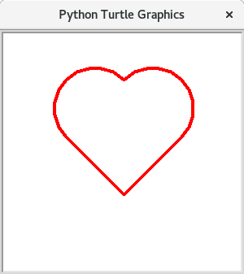

# Zeichnen von Kreisen


Möchte man zum Beispiel einen Kreis oder einen Teil eines Kreises zeichnen, so benötigt man
gebogene Linien.


```python
t.circle(radius=150)
```

Wenn man möchte kann man zusätzlich noch `extent` also wie viel Grad des Kreises
gezeichnet werden soll angeben. Außerdem kann man noch in `steps` angeben wie viele "Ecken" der Kreis hat.
Computer zeichnen nie wirkliche Kreise, sondern immer nur Vielecke mit sehr vielen Ecken...
Soll zum Beispiel ein Halbkreis mit Radius 50 gezeichnet werden, kann folgender Befehl verwendet werden:

```python
t.circle(radius=50, extent=180, steps=5)
```

> ### Übungen
>
> 1. Zeichnen Sie ein Herz in der Datei `herzi.py`. Gehen Sie von einem Quadrat als Grundfläche aus.
> 3. Bonus: Schauen Sie in der [Turtle Befehlssammlung](150-turtlebefehle.md) nach, wie Sie das Herz farbig gestalten können, bzw. die Linien anders gestalten können.
>
> 
