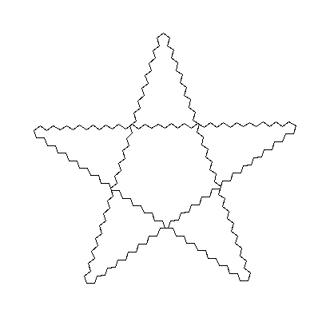

# Wiederholte Wiederholungen


In diesem Beispiel sind für eine Linie des Sternes `t.circle` und `t.forward` wiederholt.
Um nun den Stern zu Zeichnen muss diese Wiederholung wiederholt werden.

Man kann ein `for` in einem anderen `for` schreiben. Man muss dann nur darauf achten, dass die Einrückungen richtig sind. Alle Zeilen die 5 mal wiederholt werden sollen müssen mit 4 Leerzeichen eingerückt sein, alle die 5 mal 20 mal wiederholt werden sollen müssen 8 Leerzeichen eingerückt werden.

```
for sternarm in range(5):
    for kreis in range(20):
        t.circle(10)
        t.forward(20)
    t.circle(10)
    t.right(144)
```

## Kurze Bemerkung zur **Einrückung**

> ### Merke
> Immer einrücken nach einem Doppelpunkt und immer wenn Thonny nicht automatisch einrückt, wo es eigentlich einrücken sollte, fehlt davor ein Doppelpunkt.

Python verwendet verschieden starke Einrückungen, um die Zusammengehörigkeit von Befehlen zu markieren. Ist also zum Beispiel eine Zeile nach dem `for` Befehl mehr eingerückt als das `for` selbst, so gehört diese Zeile zu diesem `for`. Einrückungen sind immer notwendig nach einem Doppelpunkt und andersherum sind Doppelpunkte immer notwendig vor Einrückungen. Auch innerhalb eines eingerückten Bereiches kann wieder ein `for` vorkommen. Der Eingerückte teil des inneren `for`s muss dann noch weiter eingerückt werden.

> ### Übung
>
> Speichern Sie folgendes in eine `fünfsten-variation.py` Datei.
> 1. Zeichnen Sie einen Fünstern indem Sie `for` benutzen. Sie brauchen natürlich auch `t.forward` und `t.left` …
> 2. Ersetzen Sie das `t.forward` durch ein weiteres for und zeichnen Sie ein Muster statt der Kante:
>
> 
