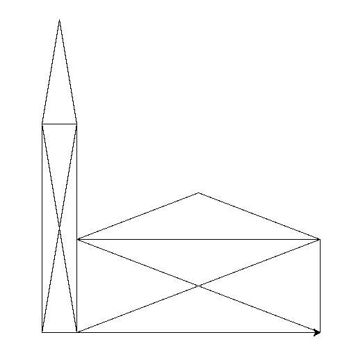

# Erstellen einer Funktion die eine Diagonale zeichnet

> ### Ziel des Kapitels:
> * Ein Beispiel für die Verwendung einer Funktion
> * nicht von der Mathematik abschrecken lassen.

Beim Nikolaushaus war deutlich, dass man zum Zeichnen einer Diagonalen etwas rechnen (oder ausprobieren) muss, sodass man die Länge der Diagonalen im Quadrat richtig hat. Es wäre doch schön, wenn man einfach schreiben könnte:

```python
diagonale(x=100, y=200)
```

Das Programm soll damit selbstständig die Diagonale in der richtigen Länge zeichnen. Dabei ist `x` die Ankathete und `y` die Gegenkathete.

Mit dem Wissen aus dem vorherigen Kapitel können wir also diese Funktion erstellen:

## Grundgerüst

```python
def diagonale(x, y):
    t.forward(z)      # Um die Länge der Diagonale nach vorne gehen.
```

Das einzige Problem ist: Die Entfernung `z` muss noch berechnet werden. Es ist ja sofort klar, dass hier ein rechtwinkliges Dreieck vorliegt und damit muss mit dem Pythagoras gearbeitet werden: `a² + b² = c²` oder genauer in unserem Fall `x² + y² = z²`. Das Quadreat kann man ja einfach als `x * x` schreiben. Fügen wir also die Quadrate unserer Funktion hinzu:

## Quadrieren

```python
def diagonale(x, y):
    xquadrat = x * x  # Berechnen von x²
    yquadrat = y * y  # Berechnen von y²
    t.forward(z)      # Um die Länge der Diagonale nach vorne gehen.
```

Für `z²` müssen jetzt noch die beiden zusammen addiert werden:

```python
zquadrat = xquadrat + yquadrat # Zusammenaddieren zu z²
```

## Wurzel ziehen

Für den `forward`-Befehl wird aber nur `z` benötigt. Das heißt man muss noch die Wurzel aus dem `zquadrat` ziehen. Die Wurzelfunktion ist nicht standardmäßig bei Python dabei, sondern man muss sie extra laden, so wie auch das `turtle`-Modul. Wir schreiben also zu Anfang der `diagonale`-Funktion `import math` und können dann mit `mat.sqrt(zahl)` die Wurzel aus `zahl` rechnen. Die gesamte `diagonale`-Funktion sieht jetzt also so aus:

```python
def diagonale(x, y):
    import math
    xquadrat = x * x  # Berechnen von x²
    yquadrat = y * y  # Berechnen von y²
    zquadrat = xquadrat + yquadrat # Zusammenaddieren zu z²
    z = math.sqrt(zquadrat)  # Die Wurzel ziehen
    t.forward(z)      # Um die Länge der Diagonale nach vorne gehen.
```

## Winkel berechnen

Diese Funktion berechnet jetzt schon selbstständig die Länge der Diagonalen, allerdings fehlt noch die Richtung. Gerade wenn man nicht im Quadrat ist, sondern im Rechteck ist der Winkel kein vielfaches von 45°. Das heißt auch er muss berechnet werden. Wäre doch super, wenn unsere `diagonale`-Funktion das gleich mitmachen würde oder? Dann kann man getrost vergessen, wie die ganze Mathematik ging.

Also dann mal los. Der Winkel im rechtwinkligen Dreieck berechnet sich, da wir Ankathete und Gegenkathete gegeben haben mit dem Tangens genauer mit der `tan¹` beziehungsweise `atan`. Auch diese Funktion gibt es im `math` modul, allerdings rechnet diese Funktion in Radianten statt Grad, das heißt man muss das Ergebnis noch mit der Funktion `math.degrees` umwandeln. Wir ergänzen also unsere `diagonale`-Funktion um:

```python
import math
tanbeta = y / x   # Berechnen des Verhältnisses
beta_rad = math.atan(tanbeta)  # Berechnen des Winkels in Radianten
beta = math.degrees(beta_rad)  # Konvertieren des Winkels zu Grad
t.left(beta)      # Drehen um den Winkel
```

Wenn man sich in einer Funktion dreht ist es oft sehr hilfreich sich am Ende der Funktion wieder in die Ursprungsrichtung zurück zu drehen. Sonst muss man doch wieder rechnen. Die gesamte `diagonale`-Funktion sieht jetzt also so aus:

```python
def diagonale(x, y):
    import math
    tanbeta = y / x   # Berechnen des Verhältnisses
    beta_rad = math.atan(tanbeta)  # Berechnen des Winkels in Radianten
    beta = math.degrees(beta_rad)  # Konvertieren des Winkels zu Grad
    t.left(beta)      # Drehen um den Winkel
    xquadrat = x * x  # Berechnen von x²
    yquadrat = y * y  # Berechnen von y²
    zquadrat = xquadrat + yquadrat # Zusammenaddieren zu z²
    z = math.sqrt(zquadrat)  # Die Wurzel ziehen
    t.forward(z)      # Um die Länge der Diagonale nach vorne gehen.
    t.right(beta)
```

## Beispiel Verwendung beim Zeichnen eines Dreiecks

Mit dieser diagonale Funktion kann jetzt ein beliebiges rechtwinkliges Dreieck gezeichnet werden:

```python
breite = 170
hoehe = 67

diagonale(hoehe, breite)
t.right(90)
t.forward(hoehe)
t.right(90)
t.forward(breite)
```

> ### Übung
> 1. Zeichnen Sie das Haus vom Nikolaus mit einer Funktion.
> 1. Verwenden Sie die `diagonale`-Funktion aus diesem Kapitel. (Sie müssen die Funktion in ihr Programm kopieren) Die `diagonale`-Funktion geht nicht immer in die richtige Richtung diagonal. Experimentieren Sie mit `t.left(180)` sowie mit negativen Werten bei `breite` und `hoehe`.
> 1. Machen Sie die Breite und Höhe des Hauses variabel.  Das Ergebnis für die folgenden Beiden Aufrufe:
>    ```python
>    nikolaus(breite=50, hoehe=300)
>    nikolaus(breite=350, hoehe=134)
>    ```
>
> 
> Bonus für schnelle: Malen Sie viele Nikolaushäuser zufälliger Größe nebeneinander
