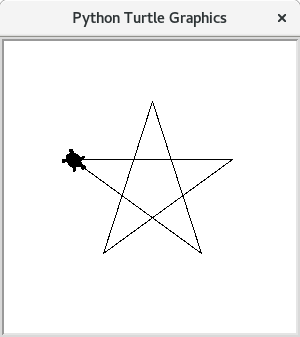

# Sterne zeichnen mit Turtle


> ### Übung
>
> Speichern Sie diese Übung als `sternchen-uebung.py`
>
> Zeichnen Sie einen Fünfstern oder kopieren Sie sich das aus den Aufgaben vorher.
>
> 

Im Folgenden wird es Ziel sein viele unterschiedlich große Fünfsterne zu zeichnen.
Eine Möglichkeit das zu tun wäre nun, den bisher geschriebenen Code einfach zu kopieren und woanders wieder einzufügen.
Man muss nun nur noch ein paar Zahlen ändern und fertig ist der zweite Stern.

Schon ab zwanzig verschieden großen Sternen artet das aber in Arbeit aus.

## Funktionen als wiederverwendbare Schablonen

Beim Programmieren möchte man aber solche wiederholende Aufgaben eigentlich lieber den Computer selbst machen lassen.
Das heißt man schreibt zunächst eine Art Schablone und sagt dem Computer was er veränderbar in dieser Schablone machen soll.

Statt dem Bild der Schablone könnte man sich auch ein Kochrezept vorstellen. Man schreibt in das Rezept wie ein Kuchen oder ähnliches gebacken wird.

Bei beiden Bildern, Schablone und Rezept, wird klar, dass man noch kein Bild bzw. Kuchen hat, wenn man das Rezept fertig hat. So ist es auch hier beim Programmieren.

Eine Schablone beim Programmieren nennt man Funktion, und erstellt sie so:

```
def stern(groesse):
    for n in range(5);
      t.forward(groesse)
      t.left(144)
```

Indem man zunächst das Schlüsselwort `def` schreibt, sagt man Python, dass nun eine Schablone kommt, die nicht sofort ausgeführt
werden soll, sondern die sich das Programm erst mal merken soll. Danach folgt ein beliebiger Name; in diesem Fall ist `stern` gewählt worden.
Zuletzt kommt in Klammern eine Liste der veränderlichen Namen als Platzhalter. Für den Stern wird erst mal nur die `groesse` veränderlich sein.
Statt nun eine feste Zahl vorwärts zu gehen, muss man jetzt die veränderliche Größe aus der Schablone vorwärts gehen.
Für alle Fünfsterne sind die Winkel die selben. Das heißt man kann die Zeilen mit `left` unveränderbar lassen,
indem man einfach konstante Zahlen schreibt.

Diese Funktionsschablone wird jetzt aber noch nicht ausgeführt. Man sagt Python nur wie die Schablone bzw. das Rezept aussieht.
Um jetzt einen Stern zu zeichnen, muss man diese Schablone verwenden, und Python sagen, welcher Platzhalter welchen Wert annehmen soll.

```
stern(groesse=100)
```

> ### Achtung:
> die Verwendung der Schablone muss wieder ganz vorne, also ohne Leerzeichen davor sein.

Jetzt wird tatsächlich etwas gezeichnet.
Zunächst schreibt man also einfach den Namen der Funktion,
dann in Klammern die Zuweisungen und schließlich welcher Platzhalter welchen Wert erhalten soll.

Es kann Ihnen auffallen,dass Sie die ganze Zeit schon solche Funktionen verwendet haben zum Beispiel `print`, `t.forward`, `t.left`, `t.right` usw…

> ### Übung
>
> 1. Erstellen Sie eine Funktion für einen Fünfstern.
> 2. Zeichnen Sie einen Kreis mit Fünfsternen außen dran. Achten Sie darauf, dass die Sterne senkrecht auf dem Kreis stehen.
>
> 
