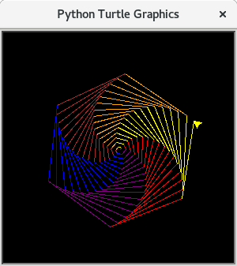
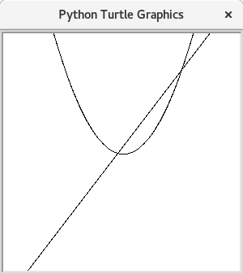

# Eine Liste von möglichen Turtlegrafiken

## YinYang

Benötigt werden:
  * [Kreise](035-kreise.md)
  * [Bewegen ohne Zeichnen](020-turtle.md#das-turtle-bewegen-ohne-zu-zeichnen)
  * [begin_fill, end_fill](150-turtlebefehle.md)

  

## Sechseckspirale
Zeichnen Sie eine Sechseckspirale. Der Trick ist, dass man nicht genau den Winkel 60° dreht, sondern knapp daneben z.B. 59°. Die Farben müssen aus einer Liste von Farben ausgewählt werden.

Benötigt werden:

  * [Forschleifen](040-forschleifen.md)
  * [Listen für die Farben](090-listen.md)

  

## Viereckspirale

Zeichnen Sie eine Viereckspirale in Schwarzweiß. Der Trick ist, dass man nicht genau den Winkel 90° dreht, sondern knapp daneben z.B. 89°.

Benötigt werden:

  * [Forschleifen](040-forschleifen.md)

  

## Viereckspirale bunt

Zeichnen Sie eine Viereckspirale. Die Farben müssen aus einer Liste von Farben ausgewählt werden.

Benötigt werden:

  * [Forschleifen](040-forschleifen.md)
  * [Listen für die Farben](090-listen.md)

  

## Mathematische Graphen

Mit turtle und der `goto(x,y)` Funktion kann man sehr gut mathematische Graphen, wie zum Beispiel Parabeln zeichnen.

Benötigt werden:

  * [Forschleifen](040-forschleifen.md)
  * [Goto](150-turtlebefehle.md)
  * [Bewegen ohne Zeichnen](020-turtle.md#das-turtle-bewegen-ohne-zu-zeichnen)

  

## Mandala mit Herzen

Zeichnen Sie ein Mandala mit Sternchen, Herzen und Kreisen.

Benötigt werden:

  * [Forschleifen](040-forschleifen.md)
  * [Funktionen](120-funktionen.md)
  * [Das Herz](035-kreise.md)
  * [begin_fill, end_fill](150-turtlebefehle.md)

  
